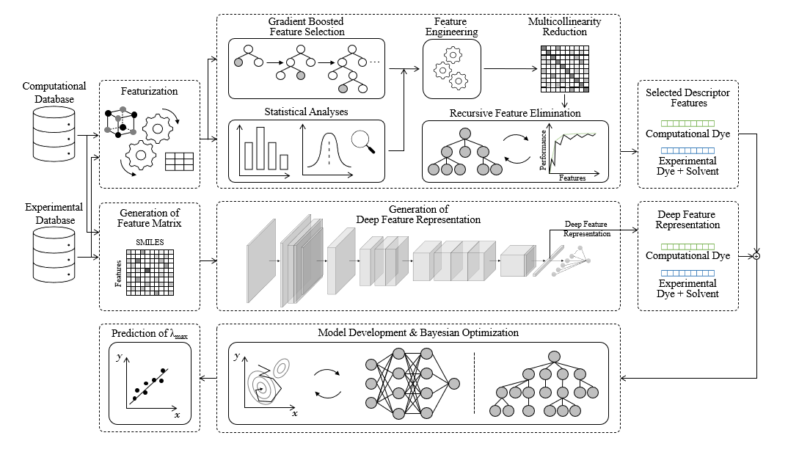
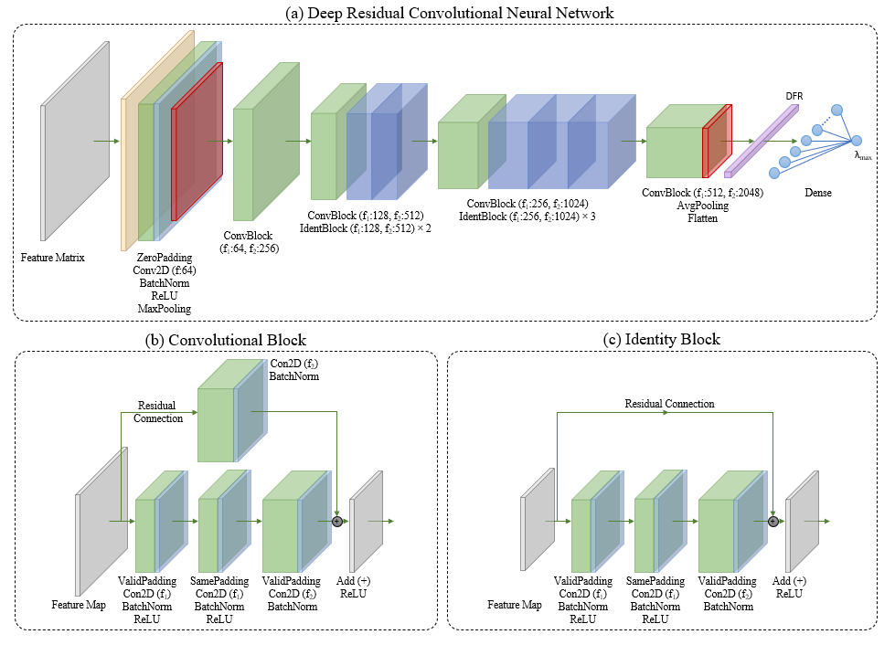
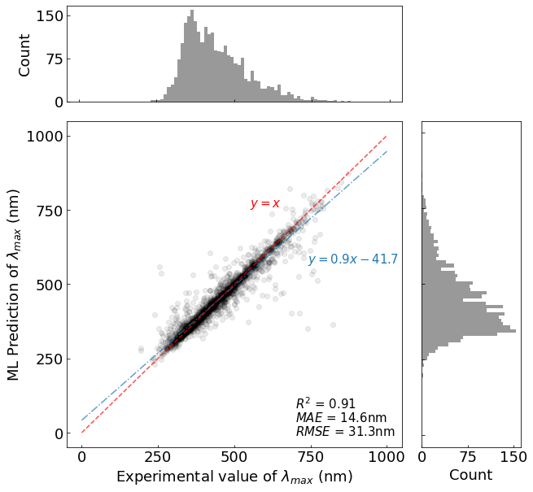
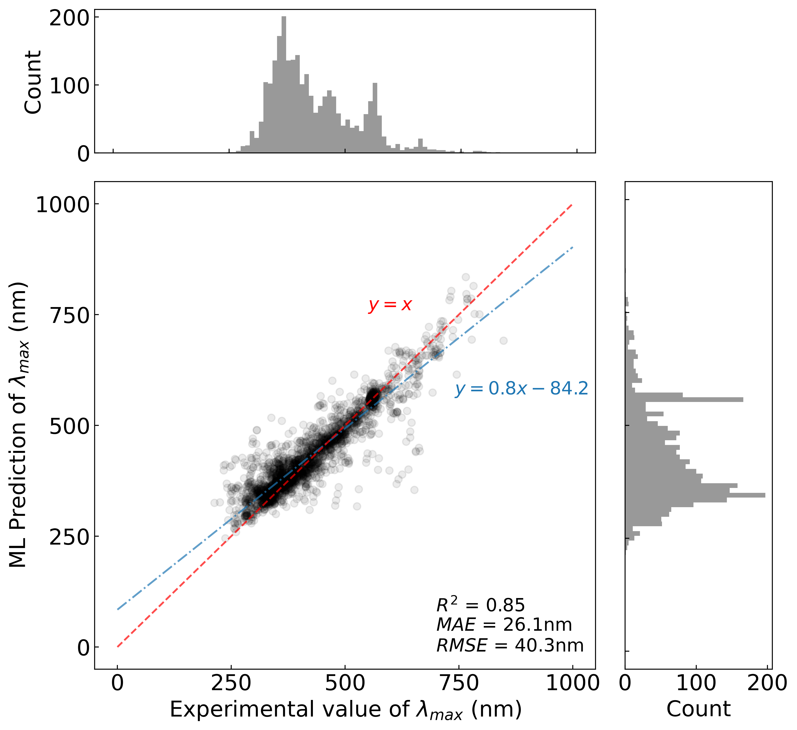

# Automatic Prediction of Peak Optical Absorption Wavelengths in Molecules using Convolutional Neural Networks

All source code and images are associated with the paper:

"Automatic Prediction of Peak Optical Absorption Wavelengths in Molecules using Convolutional Neural Networks" 

By S. G. Jung, G. J & J. M. Cole

## Introduction

The description of each file is summarized below:

*(i) smile_descriptors.py*

Script to generate descriptor features based on SMILES of chemical molecules & solvents. 

*(ii) smiles_feature_matrix.py*

Script to generate two-dimensional feature matrix (i.e. 2D image) of the chemical molecules & solvents based on their SMILES respresentation.

*(iii) deep_convolutional_representation.py*

Script to create and train deep residual convolutional neural networks, taking the 2D feature matrices as input.

*(iv) GBFS.py*

Script to perform gradient boosted feature selection, generate feature ranking, and carry out recursive feature selection. See "Gradient Boosted and Statistical Feature Selection" in [https://github.com/Songyosk/GBSFS4MPP](https://github.com/Songyosk/GBFS4MPPML).

*(v) Multicollinearity_reduction.py*

Script to perform multicollinearity reduction, which includes correlation analysis and hierarchical clustering analysis. Correlation and linkage thresholds are defined to elminate features. 

*(vi) optimization.py*

Script to perform Bayesian optimization, which determines the architecture of the predictive model based on a defined hyperparameter space.  

*(vii) evaluate_model.py*

Script to evaluate models by returning performance metrics and plots. 

## Model Architecture
The overview of the project pipeline:
Figure 1

The Deep-CNN architecture:
Figure 2

The GBFS pipeline can be found in: [https://github.com/Songyosk/GBSFS4MPP](https://github.com/Songyosk/GBFS4MPPML)

## Results
The final results of the multi-fidelity prediction of the optical peaks are shown below:

Figure 3: Multi-Fidelity Prediction of the Optical Peaks (Random Split)

Figure 4: Multi-Fidelity Prediction of the Optical Peaks (Scaffold Split)

## Acknowledgements
J.M.C. conceived the overarching project. The study was designed by S.G.J. and J.M.C. S.G.J. created the workflow, designed the CNN architecture, performed data pre-processing, featurization, hyperparameter optimization, and analysed the data under the supervision of J.M.C. G.J. assisted with the design of the CNN architecture and contributed to the hyperparameter optimization. S.G.J. drafted the manuscript with the assistance from J.M.C. The final manuscript was read and approved by all authors.

## 🔗 Links

## License

